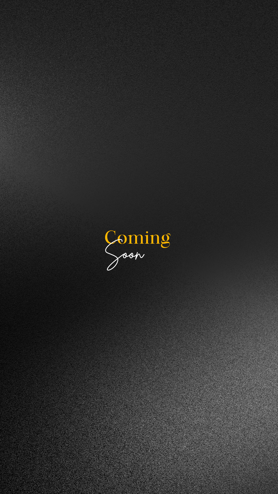

# Ankan's Developer Portfolio


Welcome to the official repository for my personal developer portfolio. This project showcases my skills in web development, my passion for solving complex problems, and my dedication to creating beautiful, user-centric digital experiences.

**[Live Demo](https://ankanz-portfolio.vercel.app/)** (replace with your actual deployment link)

---

## ✨ Features

- **Stunning Animations**: Built with `Framer Motion` to create fluid, engaging animations and micro-interactions.
- **Dynamic Project Showcase**: Features a filterable grid of my top projects, fetched directly from the GitHub API.
- **Interactive Blog Carousel**: A sleek, 3D flipping card carousel to display my thoughts on technology and problem-solving.
- **Creative Hero Section**: An eye-catching hero section with custom animations to make a strong first impression.
- **Responsive Design**: Fully responsive and optimized for a seamless experience on all devices, from desktops to mobile phones.
- **Themed Experience**: Includes a theme toggler for light and dark modes.

---

## 🛠️ Tech Stack

This portfolio is built with a modern, robust tech stack:

- **[Next.js](https://nextjs.org/)**: A React framework for building fast, server-rendered applications.
- **[TypeScript](https://www.typescriptlang.org/)**: For static typing and improved developer experience.
- **[Tailwind CSS](https://tailwindcss.com/)**: A utility-first CSS framework for rapid UI development.
- **[Framer Motion](https://www.framer.com/motion/)**: For creating complex animations and gestures.
- **[Lucide React](https://lucide.dev/)**: For beautiful and consistent icons.
- **[shadcn/ui](https://ui.shadcn.com/)**: A collection of reusable UI components.

---

## 🚀 Getting Started

To get a local copy up and running, follow these simple steps.

### Prerequisites

Make sure you have [Node.js](https://nodejs.org/) (version 18.x or later) and [pnpm](https://pnpm.io/) installed on your machine.

### Installation

1.  **Clone the repository:**
    ```sh
    git clone https://github.com/ankanz1/Portfolio.git
    ```
2.  **Navigate to the project directory:**
    ```sh
    cd Portfolio
    ```
3.  **Install dependencies:**
    ```sh
    pnpm install
    ```
4.  **Run the development server:**
    ```sh
    pnpm run dev
    ```

Open [http://localhost:3000](http://localhost:3000) with your browser to see the result.

---

## 📸 Screenshots

*(Add screenshots or GIFs of your portfolio here to give visitors a preview!)*

| Desktop View                               | Mobile View                                |
| ------------------------------------------ | ------------------------------------------ |
|  |  |

---

## 🌐 Connect with Me

I'm always open to connecting and collaborating on exciting projects.

- **LinkedIn**: [Ankan Mukherjee](https://www.linkedin.com/in/ankan-mukherjee)
- **GitHub**: [@ankanz1](https://github.com/ankanz1)
- **Twitter / X**: [@ankz01](https://x.com/_ankz01)

---

<p align="center">
  Made with ❤️ by Ankan
</p> 
